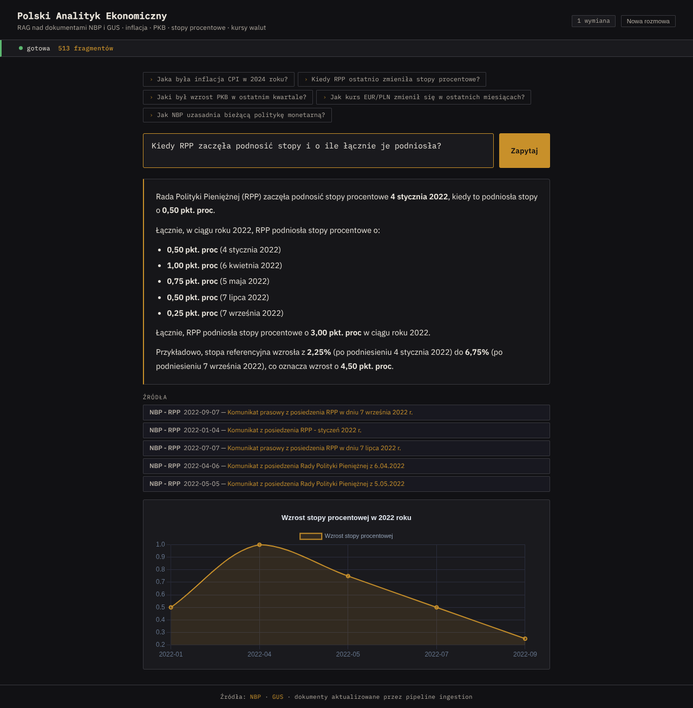
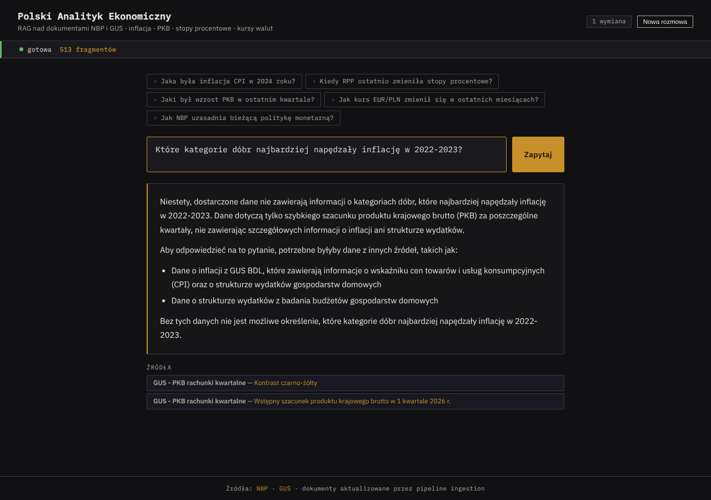
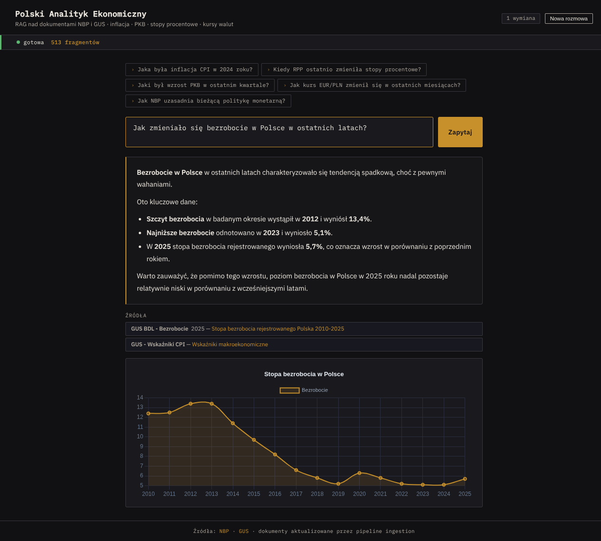
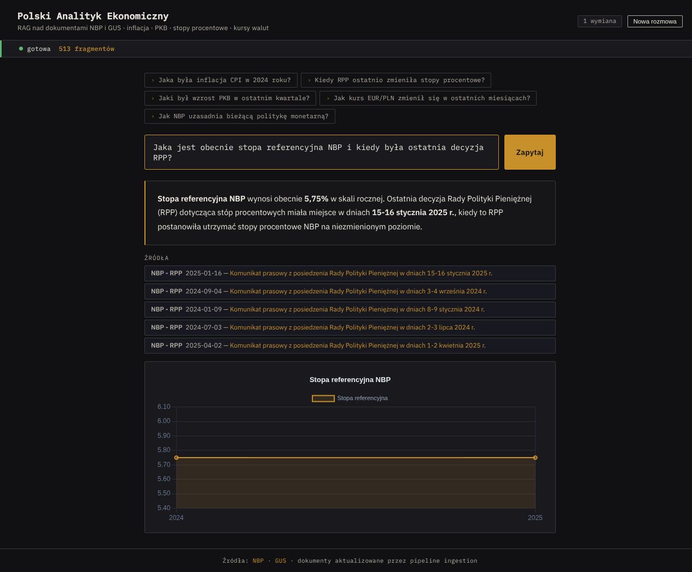
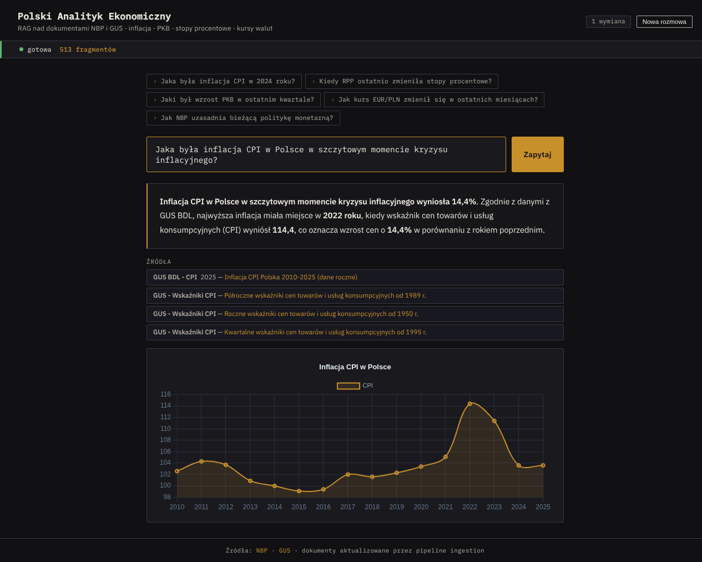

# Polski Analityk Ekonomiczny

**RAG-powered economic analyst** for Polish macroeconomic data - asks questions in Polish, answers with context, cites sources, and auto-generates charts from the data.

**[Live demo → nbp-gus-qa.onrender.com](https://nbp-gus-qa.onrender.com)**

---

## Showcase

| | |
|---|---|
|  |  |
| *When did the MPC start raising rates?* | *Which categories drove inflation in 2022-2023?* |
|  |  |
| *How has unemployment changed?* | *Current NBP reference rate and latest MPC decision* |


*CPI inflation at the peak of the crisis*

---

## What it does

Ask a question about the Polish economy. The app retrieves relevant document chunks from a vector database, passes them to an LLM with an analyst-style prompt, streams the response token-by-token, and then - if the answer contains time-series or comparable data - automatically generates an inline Chart.js visualisation.

---

## Features

- **Streaming responses** - SSE (Server-Sent Events) with live token streaming; no waiting for the full answer
- **Inline chart generation** - a second LLM pass extracts Chart.js config from the answer and renders line/bar charts automatically
- **Conversation history** - multi-turn follow-ups retain context (last 6 exchanges)
- **Source attribution** - every answer cites the documents it drew from
- **Markdown rendering** - bold numbers, bullet lists, headers rendered in the UI

---

## Stack

| Layer | Technology |
|---|---|
| Backend | FastAPI, Python 3.11 |
| Vector store | ChromaDB |
| Embeddings | Jina AI API (`jina-embeddings-v3`) |
| LLM | Groq - `llama-3.3-70b-versatile` (answer) + `llama-3.1-8b-instant` (chart extraction) |
| Deploy | Docker on Render free tier |
| Frontend | Vanilla JS, Chart.js 4, marked.js |

---

## Data sources

| Source | What's indexed |
|---|---|
| **NBP JSON API** | Exchange rate tables A/B/C (last 30 days), gold price |
| **GUS BDL API** | CPI annual timeseries 2003–2025 (overall + 8 categories), average wages 2010–2024, unemployment rate 2010–2024 |
| **GUS stat.gov.pl** | CPI flash estimates, quarterly GDP flash estimates (HTML scraping) |

Data is pre-collected into `data/docs.json` and embedded on startup - Render's free tier can't reach Polish government domains, so scraping runs locally and the result is committed.

---

## Architecture

```
User question
     │
     ▼
ChromaDB vector search  ←── Jina AI embeddings (query)
     │  top-5 chunks
     ▼
Groq llama-3.3-70b  ──── analyst system prompt + context
     │  SSE token stream
     ▼
Frontend (marked.js render)
     │  after "done" event
     ▼
Groq llama-3.1-8b  ──── extract Chart.js config from answer
     │  "chart" SSE event
     ▼
Chart.js render
```

---

## Local setup

```bash
git clone https://github.com/olaf-siestrzykowski/nbp-gus-qa
cd nbp-gus-qa
pip install -r requirements.txt

cp .env.example .env
# fill in GROQ_API_KEY and JINA_API_KEY

# Option A: use pre-collected data (fast)
python -m ingestion.ingest --embed

# Option B: re-scrape everything (requires internet access to NBP/GUS)
python -m ingestion.ingest

uvicorn app.main:app --reload
# → http://localhost:8000
```

---

## Project structure

```
app/
  main.py          # FastAPI routes, SSE streaming endpoint
  rag.py           # RAG pipeline: retrieval, LLM call, chart extraction
  vectorstore.py   # ChromaDB client
  config.py        # Settings (pydantic-settings)
ingestion/
  ingest.py        # Orchestrates all scrapers; --embed mode for production
  nbp_api.py       # NBP JSON API: exchange rates, gold price
  gus_bdl_api.py   # GUS BDL API: CPI timeseries, wages, unemployment
  gus_scraper.py   # GUS stat.gov.pl HTML scraper: CPI flash, GDP
  nbp_scraper.py   # NBP scraper (RPP decisions - blocked by WAF in prod)
  chunker.py       # Text chunking with overlap
frontend/
  index.html       # Single-file UI: streaming, Chart.js, markdown
data/
  docs.json        # Pre-collected documents (103 docs / 422 chunks)
```
