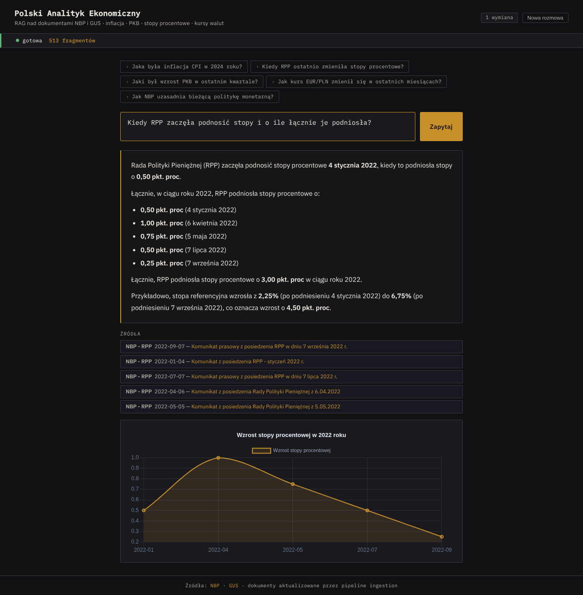
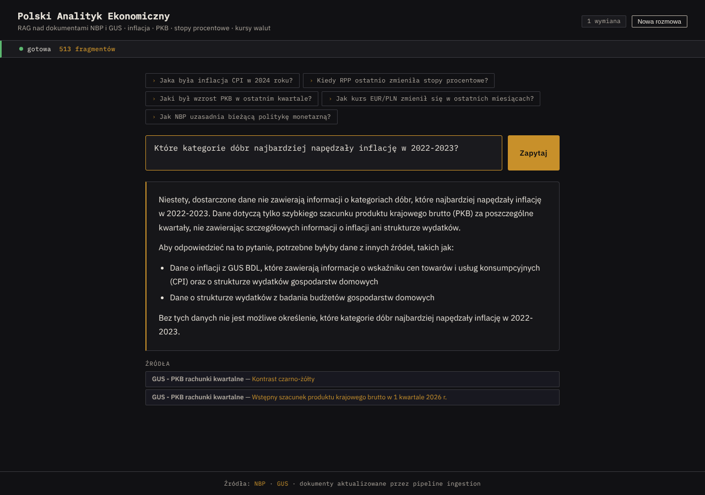
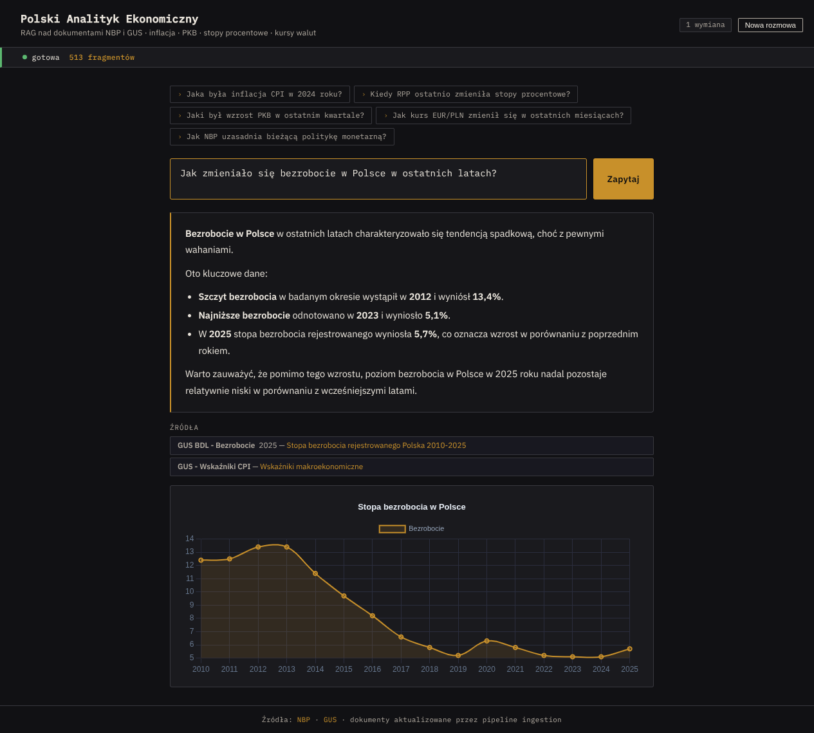
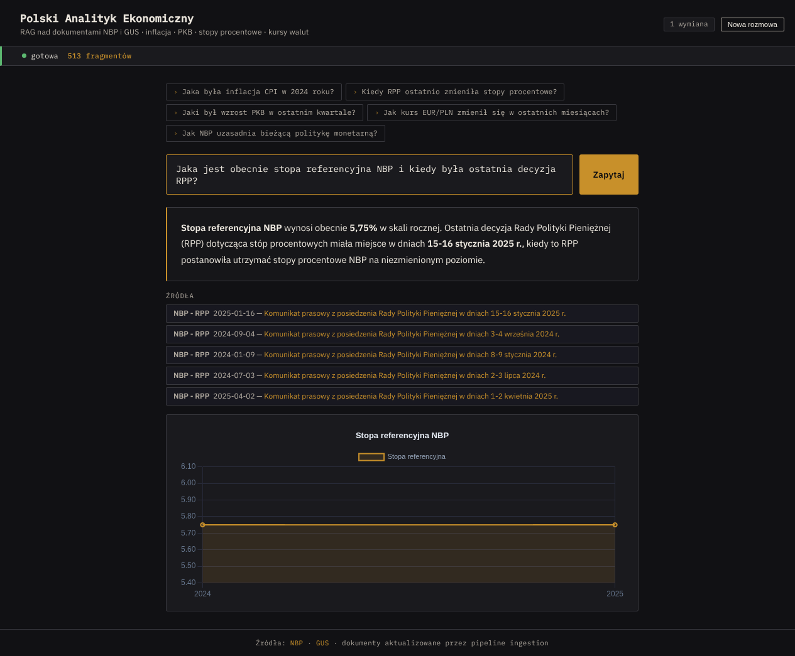
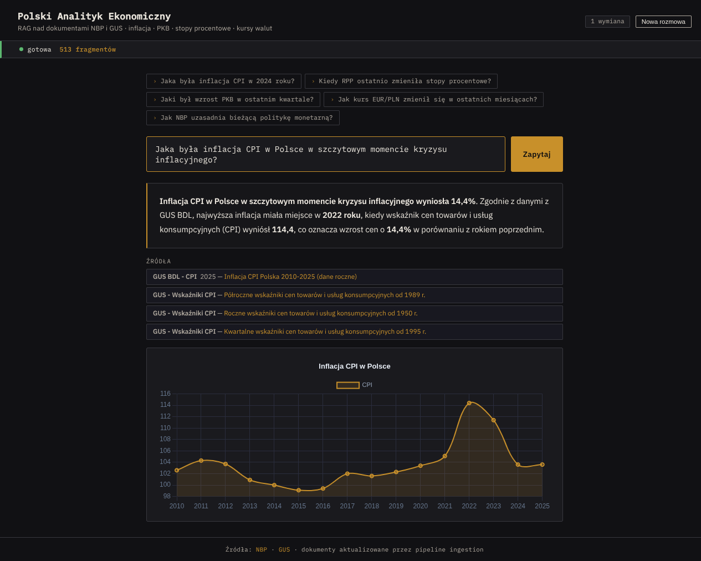

# Polski Analityk Ekonomiczny

**RAG-powered economic analyst** for Polish macroeconomic data - asks questions in Polish, answers with context, cites sources, and auto-generates charts from the data.

**[Live demo → nbp-gus-qa.onrender.com](https://nbp-gus-qa.onrender.com)**

---

## Showcase

| | |
|---|---|
|  |  |
| *When did the MPC start raising rates?* | *Which categories drove inflation in 2022-2023?* |
|  |  |
| *How has unemployment changed?* | *Current NBP reference rate and latest MPC decision* |


*CPI inflation at the peak of the crisis*

---

## What it does

Ask a question about the Polish economy. The app retrieves relevant document chunks from a vector database, passes them to an LLM with an analyst-style prompt, streams the response token-by-token, and then - if the answer contains time-series or comparable data - automatically generates an inline Chart.js visualisation.

---

## Features

- **Streaming responses** - SSE (Server-Sent Events) with live token streaming; no waiting for the full answer
- **Inline chart generation** - a second LLM pass extracts Chart.js config from the answer and renders line/bar charts automatically
- **Conversation history** - multi-turn follow-ups retain context (last 6 exchanges)
- **Source attribution** - every answer cites the documents it drew from
- **Markdown rendering** - bold numbers, bullet lists, headers rendered in the UI

---

## Stack

| Layer | Technology |
|---|---|
| Backend | FastAPI, Python 3.11 |
| Vector store | ChromaDB |
| Embeddings | Jina AI API (`jina-embeddings-v3`) |
| LLM | Groq - `openai/gpt-oss-120b` for both the answer and the chart-extraction pass (overridable via `GROQ_MODEL` / `GROQ_CHART_MODEL`) |
| Deploy | Docker on Render free tier |
| Frontend | Vanilla JS, Chart.js 4, marked.js |

---

## Data sources

| Source | What's indexed |
|---|---|
| **NBP JSON API** | Exchange rate tables A/B/C (last 30 days), gold price |
| **GUS BDL API** | CPI annual timeseries 2003–2025 (overall + 8 categories), average wages 2010–2024, unemployment rate 2010–2024 |
| **GUS stat.gov.pl** | CPI flash estimates, quarterly GDP flash estimates (HTML scraping) |

Data is pre-collected into `data/docs.json` and embedded on startup - Render's free tier can't reach Polish government domains, so scraping runs locally and the result is committed.

---

## Architecture

```
User question
     │
     ▼
ChromaDB vector search  ←── Jina AI embeddings (query)
     │  top-5 chunks
     ▼
Groq gpt-oss-120b  ──── analyst system prompt + context
     │  SSE token stream
     ▼
Frontend (marked.js render)
     │  after "done" event
     ▼
Groq gpt-oss-120b  ──── extract Chart.js config from answer
     │  "chart" SSE event
     ▼
Chart.js render
```

---

## Evaluation

`python -m eval.run_eval` asks 26 questions whose answers are **computed from
`data/docs.json`**, not typed by hand (CPI, unemployment and wages by year, CPI
categories, NBP reference rate after given MPC meetings, peak years), plus questions
the data cannot answer. It measures whether the right source was retrieved, whether
the expected number is in the answer, and whether the model refuses instead of
guessing. Results: [`eval/REPORT.md`](eval/REPORT.md).

| | Retrieval hit | Answer correct | Refused when it should |
|---|---|---|---|
| Vector search only ([baseline](eval/REPORT_before_routing.md)) | 19/22 | 19/22 | 3/4* |
| With indicator routing (current) | **22/22** | **22/22** | **3/3** |

\* the 4th was a refusal phrased "Brak dostępnych danych", missed by the first
version of the checker. Current run: one question got no answer because the Groq
daily quota ran out and is reported separately, not counted as wrong.

In the baseline every wrong answer came from retrieval, not the model: it got the
wrong documents and said it had no data rather than inventing a number.

## Design decisions

- **Routing for time series, vector search for text.** Each indicator table (CPI,
  wages, unemployment, CPI categories, gold) is one chunk among ~500, most of them
  near-identical exchange-rate tables and MPC statements. Vector search regularly
  missed the table even in the top 10, so questions naming an indicator get that
  table added to the context directly (`app/rag.py`, `ROUTES`); vector search fills
  the rest. MPC statements, where wording matters, stay with vector search.
- **Numbers are converted in the prompt, and checked by the eval.** GUS publishes CPI
  as "previous year = 100"; the prompt spells out the conversion (114.4 → 14.4%)
  after the model once subtracted consecutive years.
- **Graceful degradation on free tiers.** Groq retires models and has per-model
  daily quotas. When the main model hits its daily quota or is retired, the app
  falls back to `GROQ_FALLBACK_MODEL`; if that fails too, the UI shows an error
  instead of an empty stream.
- **Committed data snapshot.** Render's free tier cannot reach Polish government
  sites, so `data/docs.json` is scraped locally and committed; answers are only as
  fresh as the snapshot.

## Local setup

```bash
git clone https://github.com/olaf-siestrzykowski/nbp-gus-qa
cd nbp-gus-qa
pip install -r requirements.txt

cp .env.example .env
# fill in GROQ_API_KEY and JINA_API_KEY

# Option A: use pre-collected data (fast)
python -m ingestion.ingest --embed

# Option B: re-scrape everything (requires internet access to NBP/GUS)
python -m ingestion.ingest

uvicorn app.main:app --reload
# → http://localhost:8000
```

---

## Project structure

```
app/
  main.py          # FastAPI routes, SSE streaming endpoint
  rag.py           # RAG pipeline: indicator routing + retrieval, LLM call with fallback, charts
  vectorstore.py   # ChromaDB client
  config.py        # Settings (pydantic-settings)
ingestion/
  ingest.py        # Orchestrates all scrapers; --embed mode for production
  nbp_api.py       # NBP JSON API: exchange rates, gold price
  gus_bdl_api.py   # GUS BDL API: CPI timeseries, wages, unemployment
  gus_scraper.py   # GUS stat.gov.pl HTML scraper: CPI flash, GDP
  nbp_scraper.py   # NBP scraper (RPP decisions - blocked by WAF in prod)
  chunker.py       # Text chunking with overlap
frontend/
  index.html       # Single-file UI: streaming, Chart.js, markdown
data/
  docs.json        # Pre-collected documents (158 docs / 513 chunks)
eval/
  run_eval.py      # Golden questions computed from docs.json, retrieval/answer/refusal metrics
  REPORT.md        # Latest results (REPORT_before_routing.md: vector search only)
```
